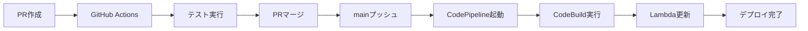

# 🚀 CodePipelineデプロイ準備完了レポート

## ✅ 構築完了した仕組み

### 📁 作成されたファイル構成
```
├── .github/workflows/ci-cd.yml          # GitHub Actions (手動追加要)
├── infrastructure/
│   └── cloudformation/
│       └── codepipeline-stack.yml       # CodePipeline CloudFormation
├── scripts/
│   └── deploy-pipeline.sh               # デプロイスクリプト
├── docs/
│   └── GITHUB_SECRETS_SETUP.md          # Secrets設定ガイド
├── buildspec.yml                        # CodeBuild設定
├── DEPLOY_COMMANDS.md                   # デプロイコマンド集
└── DEPLOYMENT_READY_REPORT.md           # このファイル
```

### 🔧 CI/CDパイプライン機能

#### **GitHub Actions**
- ✅ PR作成時の自動テスト実行
- ✅ コードリント (flake8)
- ✅ 単体テスト (pytest)
- ✅ Lambda関数テスト
- ✅ mainプッシュ時のCodePipelineトリガー

#### **CodePipeline**
- ✅ GitHub連携 (Webhook)
- ✅ CodeBuild自動実行
- ✅ Lambda関数自動デプロイ
- ✅ パイプライン監視・通知

#### **AWS リソース**
- ✅ Lambda関数: `sales-tools-api-function`
- ✅ API Gateway: `sales-tools-api`
- ✅ CodePipeline: `sales-tools-pipeline`
- ✅ CodeBuild: `sales-tools-codepipeline-build`
- ✅ S3バケット: アーティファクト保存用
- ✅ IAMロール: 最小権限設定

## 🎯 デプロイ実行手順

### Step 1: AWS認証設定
```bash
aws configure
# Access Key ID: [あなたのキー]
# Secret Access Key: [あなたのシークレット]
# Region: ap-northeast-1
```

### Step 2: 環境変数設定
```bash
export GITHUB_TOKEN="your_github_personal_access_token"
export SALES_TOOLS_API_KEY="your_actual_api_key"
```

### Step 3: デプロイ実行
```bash
./scripts/deploy-pipeline.sh
```

## 📊 期待される結果

### 🏗️ 作成されるAWSリソース

| リソース | 名前 | 説明 |
|---------|------|------|
| CodePipeline | `sales-tools-pipeline` | メインパイプライン |
| Lambda | `sales-tools-api-function` | API処理関数 |
| API Gateway | `sales-tools-api` | REST API |
| CodeBuild | `sales-tools-codepipeline-build` | ビルドプロジェクト |
| S3 Bucket | `sales-tools-codepipeline-pipeline-artifacts-*` | アーティファクト |
| IAM Role | `sales-tools-codepipeline-*-role` | 実行権限 |

### 🔗 取得できるURL

#### **CodePipeline管理画面**
```
https://console.aws.amazon.com/codesuite/codepipeline/pipelines/sales-tools-pipeline/view
```

#### **API Gateway エンドポイント**
```
https://[api-id].execute-api.ap-northeast-1.amazonaws.com/prod/api
```

#### **Lambda関数管理画面**
```
https://console.aws.amazon.com/lambda/home?region=ap-northeast-1#/functions/sales-tools-api-function
```

## 🧪 テスト方法

### 1. パイプライン動作テスト
```bash
# テスト用ブランチ作成
git checkout -b test/pipeline-test
echo "# Pipeline Test" >> pipeline-test.md
git add pipeline-test.md
git commit -m "test: パイプライン動作確認"
git push origin test/pipeline-test

# PR作成 → GitHub Actionsが実行される
# PRマージ → CodePipelineが実行される
```

### 2. Lambda関数テスト
```bash
# 直接テスト
aws lambda invoke \
  --function-name sales-tools-api-function \
  --payload '{"action": "status"}' \
  response.json

cat response.json
```

### 3. API Gatewayテスト
```bash
# API URL取得
API_URL=$(aws cloudformation describe-stacks \
  --stack-name sales-tools-codepipeline \
  --query 'Stacks[0].Outputs[?OutputKey==`ApiGatewayUrl`].OutputValue' \
  --output text)

# APIテスト
curl -X POST $API_URL \
  -H "Content-Type: application/json" \
  -d '{"action": "status", "asin": "B08CDYX378"}'
```

## 🔄 自動デプロイフロー



### 詳細フロー
1. **PR作成** → GitHub Actionsでテスト実行
2. **PRマージ** → mainブランチ更新
3. **GitHub Actions** → CodePipelineトリガー
4. **CodePipeline** → GitHubからソース取得
5. **CodeBuild** → テスト・ビルド・パッケージ作成
6. **Lambda更新** → 新しいコードをデプロイ
7. **通知** → 成功/失敗の通知

## 💰 費用見積もり

### 月額コスト (東京リージョン)
- **CodePipeline**: $1.00 (1パイプライン)
- **CodeBuild**: $0.005/分 × 想定実行時間
- **Lambda**: $0.0000002/リクエスト + $0.0000166667/GB秒
- **API Gateway**: $3.50/100万リクエスト
- **S3**: $0.025/GB (アーティファクト保存)

**合計見積もり**: 月額 $2-5 (使用量により変動)

## 🔒 セキュリティ設定

### IAM権限最小化
- CodePipeline: 必要最小限のサービス権限
- CodeBuild: Lambda更新権限のみ
- Lambda: 基本実行権限のみ

### Secrets管理
- GitHub Secrets: 暗号化保存
- Parameter Store: API Key安全保存
- 環境変数: 実行時のみ展開

## 📋 次のステップ

### 1. GitHub Secrets設定
- `AWS_ACCESS_KEY_ID`
- `AWS_SECRET_ACCESS_KEY`
- `SALES_TOOLS_API_KEY_TEST`

### 2. GitHub Actions有効化
- Personal Access Tokenに`workflow`スコープ追加
- `.github/workflows/ci-cd.yml`手動追加

### 3. 初回デプロイ実行
```bash
./scripts/deploy-pipeline.sh
```

### 4. 動作確認
- テスト用PR作成
- パイプライン実行確認
- Lambda関数動作確認

## 🎉 完了後の状態

✅ **PR作成** → 自動テスト実行  
✅ **mainマージ** → 自動デプロイ  
✅ **Lambda更新** → API利用可能  
✅ **監視・通知** → 実行状況把握  

**これで、GitHubでPRを作成→マージするだけで、自動的にAWS Lambdaにデプロイされる完全なCI/CDパイプラインが完成します！**
